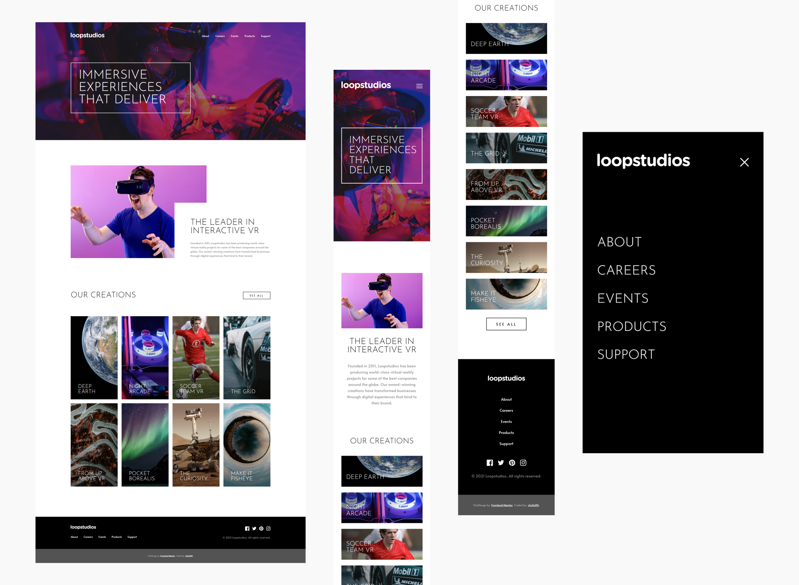

# Frontend Mentor - Loopstudios landing page solution

This is a solution to the [Loopstudios landing page challenge on Frontend Mentor](https://www.frontendmentor.io/challenges/loopstudios-landing-page-N88J5Onjw). Frontend Mentor challenges help you improve your coding skills by building realistic projects.

## Table of contents

- [Overview](#overview)
  - [The challenge](#the-challenge)
  - [Screenshot](#screenshot)
  - [Links](#links)
- [My process](#my-process)
  - [Built with](#built-with)
  - [What I learned](#what-i-learned)
  - [Continued development](#continued-development)
- [Author](#author)

## Overview

### The challenge

Users should be able to:

- View the optimal layout for the site depending on their device's screen size
- See hover states for all interactive elements on the page

### Screenshot



### Links

- Live Site URL: [https://cholis04.github.io/Loopstudios-landing-page/](https://cholis04.github.io/Loopstudios-landing-page/)

## My process

### Built with

- Mobile-first workflow
- Semantic HTML5 markup
- CSS custom properties
- Flexbox
- CSS Grid
- Input Type Checkbox
- CSS Pseudo Classes
- CSS Pseudo Element

### What I learned

Create a responsive menu by using checkboxes. By going through css pseudo class can determine a checkbox is checked or not. Then style other elements related to responsive menus. It can only affect child elements.

```html
<input
  type="checkbox"
  id="toggle-menu"
  name="toggle-menu"
  class="toggle-check"
/>
```

```css
input[type='checkbox'].toggle-check:checked {
  display: block;
}
```

I'm trying to make an overlap according to an existing design. And I learned to make overlap between Elements by using CSS Grid. As a result, it is very easy to implement. It just needs a few more adjustments to make it look exactly the same as the existing design.

```css
.about-box {
  display: grid;
  grid-template-columns: 6.5fr 2fr 4fr;
  grid-template-rows: 2fr 3fr 1fr;
}
.about-box > .about-image-grid {
  grid-column: 1/3;
  grid-row: 1/3;
}
.about-box > .about-content {
  grid-column: 2/4;
  grid-row: 2/4;
}
```

Added a border when the mouse hovers over a link. I guess it would be easy to just add a border-bottom property on the link. However, the length of the border-bottom will always follow the length of the content. whereas in existing designs the border length is only around 30% to 50%. So I decided to use css psuedo classes :after to create an empty content with a width of 50%, this means the length of the border will also be the same.

```css
a {
  position: relative;
  padding: 0.5em 0;
  color: white;
  font-size: 1em;
  font-weight: 400;
  text-decoration: none;
}
a::after {
  background: none;
  content: '';
  position: absolute;
  top: 0;
  left: 50%;
  transform: translateX(-50%);
  width: 0;
  height: 100%;
  border-bottom: 2px solid white;
}
a:hover:after {
  width: 50%;
}
```

### Continued development

Using only checkboxes to create a responsive menu has limitations in manipulating elements. At least JavaScript is needed for more flexible manipulation. When the menu is opened or fills the screen, the user can still scroll the page. this can be overcome with JavaScript, easily selecting the body element and then giving the css overflow hidden property.

## Author

- Website - [https://cholis04.github.io](https://cholis04.github.io)
- Frontend Mentor - [@cholis04](https://www.frontendmentor.io/profile/cholis04)
- Dribbble - [cholis04](https://dribbble.com/cholis04)
- Instagram - [@cholis04](https://instagram.com/cholis04)
- Codepen - [cholis04](https://codepen.io/cholis04)
